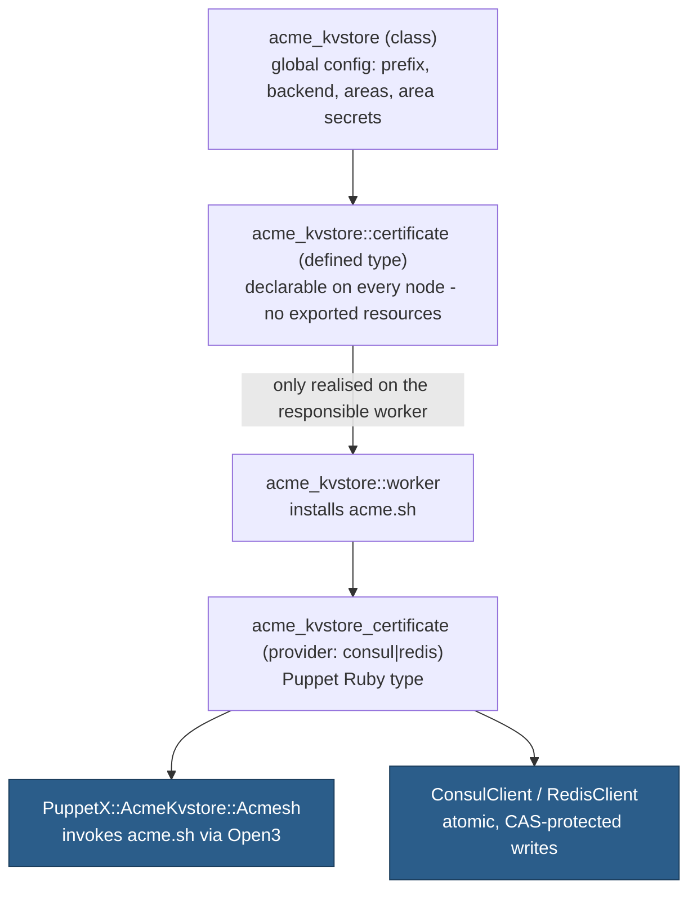
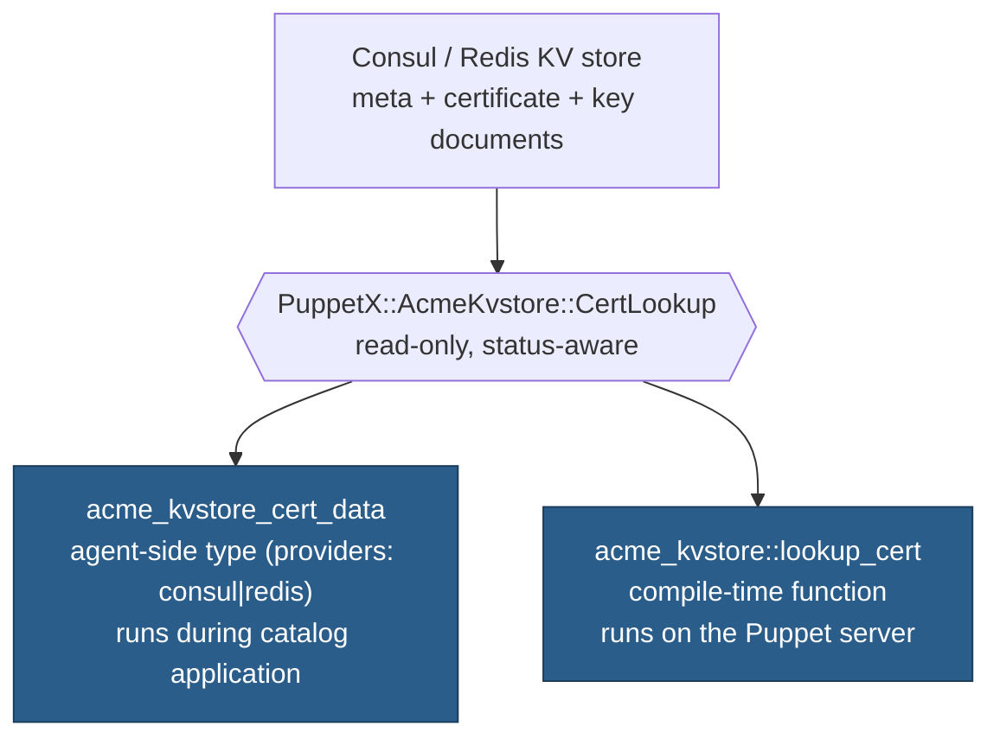

# Architecture

## Goal

`acme_kvstore` reproduces the functionality of
[`puppet-acme`](https://github.com/markt-de/puppet-acme) that matters for
most setups (certificate request/renewal via `acme.sh`, DNS/CA profiles
with accounts, centralised storage and distribution of certificates and
keys), but replaces the PuppetDB/exported-resources mechanism with direct,
compare-and-set protected storage in a Consul or Redis cluster.

## Why not exported resources?

`puppet-acme` stores certificates/keys as exported resources in PuppetDB,
which are then collected by target nodes. Operationally, this has two
drawbacks that this module avoids:

1. PuppetDB becomes a security-critical store for private keys, despite
   not being designed for that (no encryption at rest out of the box, no
   fine-grained per-key ACLs).
2. The window between "export" and "collect" depends on the Puppet run
   interval on both sides.

Instead, the ACME worker writes data **synchronously, directly and
atomically** to the KV store as soon as a certificate has been
issued/renewed.

## Components: provisioning (write) path



In addition, the purely read-only type `acme_kvstore_cert_data` and the
compile-time function `acme_kvstore::lookup_cert` exist for
target/consumer systems that need certificate data from the KV store -
entirely independent of the request/renewal workflow above:

## Components: distribution (read) path



See [docs/lookup_cert.md](lookup_cert.md) for when to use the function
instead of the type - and the `acme_kvstore::deploy` defined type built on
it for the common "write a cert/key file and notify a service" case - and
[docs/profiles.md](profiles.md) for the DNS/CA profile system referenced
by `acme_kvstore::certificate` above.

## Flow per Puppet run on the worker

1. Puppet applies the `acme_kvstore_certificate['<certid>']` resource on
   every run - only certificates configured in `acme_kvstore::certificates`
   (or declared via `acme_kvstore::certificate`) exist as resources, so
   nothing else in the KV store is ever read or renewed.
2. `exists?` performs **one** KV read: the meta document, whose
   `acme_renewal` summary (expiry, domains and key settings of the active
   version) is all it needs. `status` plays no part (see
   [Status values](#status-values)).
   - No meta document -> `false`: the certificate is issued **at once**
   - A meta document **without** `acme_renewal` (written by another tool)
     -> a warning, and `true`: it is never renewed or overwritten
   - Archived in CCI-UI (`"archived": true`) -> `true`: never renewed
   - Another version activated meanwhile (e.g. in CCI-UI, so
     `acme_renewal.version` is not `active_version`) -> the checks below
     use that active certificate itself (one extra read, until the next
     issuance)
   - The stored `domains` (or, with `purge_key_on_mismatch`, the default,
     `key_type`/`key_size`) no longer match what is now configured ->
     `false` at once (configuration drift; see
     [profiles.md](profiles.md#configuration-drift))
   - The certificate expires within `renew_before_days` -> `false`, but
     only while the time window of `renew_schedule` (if set) is open;
     outside it the renewal waits for a later run
   - otherwise -> `true` (nothing to do)
3. Only when `exists?` returns `false` does Puppet call `create`:
   - The CA profile's account (if any) is registered/reconfirmed
     (`acme.sh --register-account`)
   - `acme.sh --issue --force ...` is executed - `--force` because this
     module decides when to issue; without it acme.sh would skip while its
     own renewal date lies ahead (HTTP-01 via the worker's webroot,
     DNS-01 via a resolved DNS profile's hook with `--dnssleep`, optionally
     in DNS alias mode; logging to the worker's acme.sh log file), subject
     to `exec_timeout` (see [profiles.md](profiles.md#exec_timeout)) and,
     if configured, run as `acme_kvstore::worker`'s dedicated `user`/`group`
     (see [security.md](security.md#dedicated-worker-user))
   - Each certificate of the chain acme.sh returns is stored as an
     [issuer entry](#issuer-entries) of its own, unless it already exists
   - The private key, if present, is encrypted with AES-256-GCM using the
     32-byte area secret, bound to `cci:<area>:<certid>/<version>`
   - The meta document (with a fresh `acme_renewal` summary, keeping its
     `status`), certificate document and any key document are written via
     a **compare-and-set
     protected** read-modify-write cycle (one Consul `/v1/txn` transaction
     with the `cas` verb on the meta key's ModifyIndex; Redis `WATCH`/`MULTI`/`EXEC` on
     the meta key)
   - The optional `posthook_cmd` runs, if configured (see
     [profiles.md](profiles.md#posthook_cmd)); its failure is logged but
     never fails the resource, since the certificate has already been
     issued and stored successfully by this point

### KV operations per run

| Situation | Consul | Redis |
| --- | --- | --- |
| Worker, nothing to do (the usual case) | 1 read transaction | 1 `MGET` |
| Worker, issue/renew | 2 reads + 1 write transaction, plus 1 per new issuer entry | 2 `MGET` + `WATCH`, `GET`, `MULTI`/`EXEC`, plus the same per new issuer entry |
| Worker, `ensure => absent` | 1 read + 1 write transaction | 1 `MGET` + `WATCH`, `GET`, `MULTI`/`EXEC` |
| Consumer (`deploy`, `lookup_cert`, `acme_kvstore_cert_data`) without a chain | 2 read transactions (meta; certificate and key) | 2 `MGET` |
| Consumer with a chain, issuers recorded (`store_issuers`) | 3 read transactions (meta; certificate, key and issuer metas; issuer certificates) | 3 `MGET` |
| Consumer with a chain, otherwise | 2 read transactions + 1 recursive read of `<prefix>/<area>/certs/` | 2 `MGET` + `SCAN` and `MGET` of `<prefix>/<area>/certs/*` |

A write never reads the meta document again: it reuses the read from the
start of the run as its compare-and-set base (see below). A consumer needs
two reads because the keys of the certificate and key documents
depend on the active version stored in the meta document.

## Concurrency: compare-and-set

The meta document (`<prefix>/<area>/certids/<certid>`) is the single point of
truth used to decide the next version number and to guard every write.
Every write (`create`, `destroy`) goes through
`kv_client.transactional_update`, which:

1. Takes the meta document as read at the start of the run, together with
   its concurrency token (the Consul `ModifyIndex`; for Redis, `WATCH` on
   the key followed by a comparison with that value) - or reads it now if
   there is no such read.
2. Yields that value to the caller, which computes the writes to perform
   (e.g. the next version number, or removing `acme_renewal`).
3. Writes the result atomically, but only if the meta document has not
   changed since step 1 - otherwise a `CasConflictError` is raised
   (Consul: HTTP 409 on a failed `cas`/`check-index` operation; Redis: the
   compared value differs, or `EXEC` returns `nil` after `WATCH` detected
   a change).

If two workers (or two overlapping Puppet runs) attempt to renew the same
`certid` at the same time, only one write succeeds; the other run fails
for this resource and is retried cleanly on the next scheduled run, since
it will simply re-read the now-current meta document. See
[consul.md](consul.md) and [redis.md](redis.md) for backend-specific
details. Rotating an area secret is not covered by compare-and-set: it
needs all writers stopped (see
[security.md](security.md#area-secret-rotation)).

## KV data formats

Every key belongs to exactly one area and lives below `<prefix>/<area>/`,
so an area's ACL token (Consul `key_prefix`, Redis key pattern) can be
restricted to that area alone, and the same `certid` in two areas never
collides.

### Meta document: `<prefix>/<area>/certids/<certid>`

```json
{
  "active_version": 3,
  "latest_version": 5,
  "status": "active",
  "updated_at": "2026-09-21T10:00:00.000000Z",
  "client": "puppet",
  "updated_by": "acme-worker1.example.com",
  "acme_renewal": {
    "version": 3,
    "not_after": "2026-12-20T10:00:00Z",
    "domains": ["shop.example.com", "www.shop.example.com"],
    "key_type": "rsa",
    "key_size": 2048,
    "issuers": ["3f9a1c2b…"]
  }
}
```

All fields except `acme_renewal` are those of
[CCI-UI](cci-ui.md); `acme_renewal` is an addition CCI-UI keeps, and it
also keeps unknown fields such as `archived`. `version` is the version
`acme_renewal` describes and `issuers` the certids of its chain (issuer
of the certificate first).

`acme_renewal` marks a certificate this module issued and renews, and
summarises its active version, so the worker can decide with this one read
whether anything is to be done. It is only written for configured
certificates; a meta document without it (e.g. written by another tool) is
left alone - see [Flow per Puppet run](#flow-per-puppet-run-on-the-worker).

`client` is `$acme_kvstore::kv_client` (default `puppet`); `updated_by`
here and `created_by` in the certificate document are
`$acme_kvstore::kv_updated_by`, by default the FQDN of the writing worker.

### Certificate document: `<prefix>/<area>/certs/<certid>/<version>`

```json
{
  "pem": "<exactly one certificate as PEM>",
  "tags": ["Tag1", "Tag2"],
  "has_key": true,
  "created_at": "2026-09-21T10:00:00.000000Z",
  "client": "puppet",
  "created_by": "acme-worker1.example.com"
}
```

`tags` is always present (an empty list if there are none) - CCI-UI's
catalogue requires `pem`, `tags`, `has_key` and `created_at`. A version is
immutable: it is only ever created (Consul `cas` with index 0; Redis
`WATCH` plus an existence check), never overwritten.

### Issuer entries

Every intermediate, CA and root certificate is an entry of its own, with
one version and no key. Its certid is derived from the certificate itself:
its CN and expiry date (UTC), `<cn>_<YYYY-MM-DD>`:

```text
<prefix>/<area>/certids/r11_2027-03-12     -> { "active_version": 1, "latest_version": 1, "status": "active", ... }
<prefix>/<area>/certs/r11_2027-03-12/1     -> { "pem": "<the CA certificate>", "tags": [], "has_key": false, ... }
```

| CA certificate | certid |
| --- | --- |
| ISRG Root X1 (self-signed) | `isrg-root-x1_2035-06-04` |
| ISRG Root X1, cross-signed by DST Root CA X3 | `isrg-root-x1_2024-09-30` |
| Let's Encrypt R11 | `r11_2027-03-12` |
| COMODO RSA Certification Authority | `comodo-rsa-certification-authority_2038-01-18` |

- The CN is lower-cased, every run of characters other than `[a-z0-9]`
  becomes `-`; without a CN the `O` is used, without both `ca`.
- The name is readable - it tells which CA and until when - the same for
  the same certificate everywhere, and never changes; a new CA certificate
  (e.g. a renewed intermediate) is a new entry.
- The rare other certificate with the same CN and expiry date is stored as
  `<cn>_<YYYY-MM-DD>_<first 8 hex characters of its SHA-256 fingerprint>`;
  an existing entry is never overwritten, so a name never points to
  another certificate. This also holds for two such certificates in one
  chain, and when another worker or CCI-UI takes a name at the same time:
  the worker re-reads it, reuses it only if it holds the same certificate,
  otherwise tries the alternative name, and fails for this run (retrying
  on the next) if both hold other certificates.
- Trust stores in Hiera can therefore list CA certificates by certid, e.g.
  `[isrg-root-x1_2035-06-04, isrg-root-x2_2040-09-17]`.

With `store_issuers` (the default; global and per certificate), the
worker stores each certificate of the chain acme.sh returns this way,
before the certificate itself, unless an entry with that certid already
exists (from an earlier issuance or imported in CCI-UI) - it never changes
an existing one - and records their certids in `acme_renewal.issuers`.
With `store_issuers => false` it does neither, e.g. when intermediates are
maintained centrally in CCI-UI.

Readers build the chain only when asked to (`deploy` when a chain, full
chain or combined file is wanted; `include_chain` for `lookup_cert` and
`acme_kvstore_cert_data`):

- from `acme_renewal.issuers`, if recorded for the active version (no
  search);
- otherwise (another tool, `store_issuers => false`, another version
  activated, an issuer entry missing) like CCI-UI: all certificates of the
  area are read once, and the issuer is the one whose subject is the
  certificate's issuer, has `CA:TRUE` and whose key verifies the signature
  - repeated up to 12 levels. If that read fails (e.g. a Redis user
  without `+scan`), the result is "no chain" with the reason in
  `chain_error`, never a failed compilation.

`chain`/`fullchain` leave self-signed roots out; `acme_kvstore::deploy`'s
`chain_include_root` appends the root for applications without a trust
store (searching the area for it, since CAs rarely deliver it). Because every CA
certificate is a normal entry, it can be delivered on its own and selected
for trust stores (e.g. by certid or by `tags` set in CCI-UI).

### Key document: `<prefix>/<area>/keys/<certid>/<version>`

```json
{
  "version": 1,
  "iv": "<base64, 12 bytes>",
  "tag": "<base64, 16 bytes>",
  "data": "<base64, AES-256-GCM ciphertext of the private key>"
}
```

The envelope is CCI-UI's: AES-256-GCM with the associated data
`cci:<area>:<certid>/<version>` (independent of the prefix), so a key can
be read by both and not be moved to another version. Encryption details:
see [security.md](security.md).

## Status values

The meta document's `status` field controls **distribution only** - what
`acme_kvstore::deploy` does on a node - and has no effect on issuance or
renewal on the worker:

| Status | `acme_kvstore::deploy` | `lookup_cert` / `acme_kvstore_cert_data` |
| --- | --- | --- |
| `active` | writes the files | return certificate (and key) data |
| `norollout` | leaves existing files alone (neither writes nor removes them) | return the status only |
| `delete` | removes the files (`ensure => absent`), notifying `notify_services` | return the status only |
| anything else, or no meta document | leaves existing files alone | return the status only |

A newly issued certificate starts as `active`; after that this module
never changes `status` - an operator (or another tool) sets it directly in
the KV store, and renewals keep it as it is. Certificate/key documents are
not even read for any status but `active`. See
[PuppetX::AcmeKvstore::CertLookup](../lib/puppet_x/acme_kvstore/cert_lookup.rb),
which `lookup_cert` and `acme_kvstore_cert_data` share.

## `ensure => absent`

No old certificate/key versions are ever deleted (the audit trail is
preserved in full). `ensure => absent` on `acme_kvstore_certificate` only
removes `acme_renewal` from the meta document - a compare-and-set protected
write - so the certificate is no longer renewed; `status` and all versions
stay. Removing a certificate from `acme_kvstore::certificates` simply stops
its renewal without any write.
